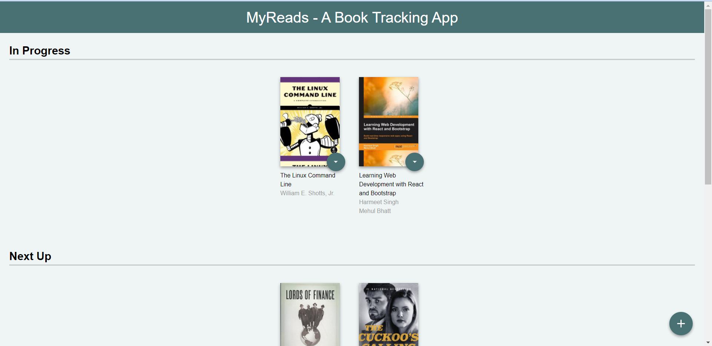
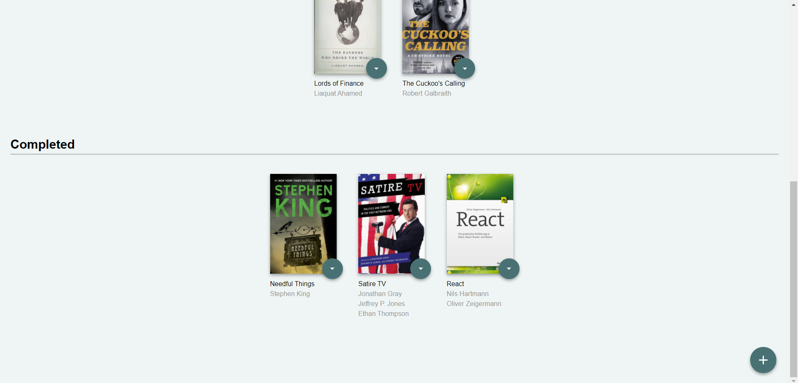
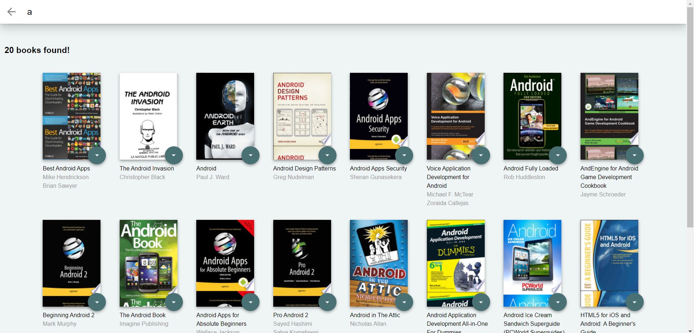

# MyReads - A Book Tracking App Project by Udacity

## About MyReads Project

This is a react project and it is part of Udacity Frontend Nanodegree course. This is a single-page app that allows user to store your books and track what you're reading, want to read and books you have completed.

## How to start 

Clone the repository, change directories, and use NPM to install the dependencies.

- $ git clone https://github.com/prosenjeetshil/MyReads-Udacity.git
- $ cd reactnd-project-myreads
- $ npm install

- install dependencies with `npm install`
- start with `npm start`

The project can be viewed in the browser at
- [http://localhost:3000](http://localhost:3000)

## Note: In case a server does'nt starts or starts but webpage is blank try installing react-router-dom version 5.2.0

npm install react-router-dom@5.2.0

## Screenshots

## Search Terms for searching books in SearchPage

'Android', 'Art', 'Artificial Intelligence', 'Astronomy', 'Austen', 'Baseball', 'Basketball', 'Bhagat', 'Biography', 'Brief', 'Business', 'Camus', 'Cervantes', 'Christie', 'Classics', 'Comics', 'Cook', 'Cricket', 'Cycling', 'Desai', 'Design', 'Development', 'Digital Marketing', 'Drama', 'Drawing', 'Dumas', 'Education', 'Everything', 'Fantasy', 'Film', 'Finance', 'First', 'Fitness', 'Football', 'Future', 'Games', 'Gandhi', 'Homer', 'Horror', 'Hugo', 'Ibsen', 'Journey', 'Kafka', 'King', 'Lahiri', 'Larsson', 'Learn', 'Literary Fiction', 'Make', 'Manage', 'Marquez', 'Money', 'Mystery', 'Negotiate', 'Painting', 'Philosophy', 'Photography', 'Poetry', 'Production', 'Programming', 'React', 'Redux', 'River', 'Robotics', 'Rowling', 'Satire', 'Science Fiction', 'Shakespeare', 'Singh', 'Swimming', 'Tale', 'Thrun', 'Time', 'Tolstoy', 'Travel', 'Ultimate', 'Virtual Reality', 'Web Development', 'iOS'